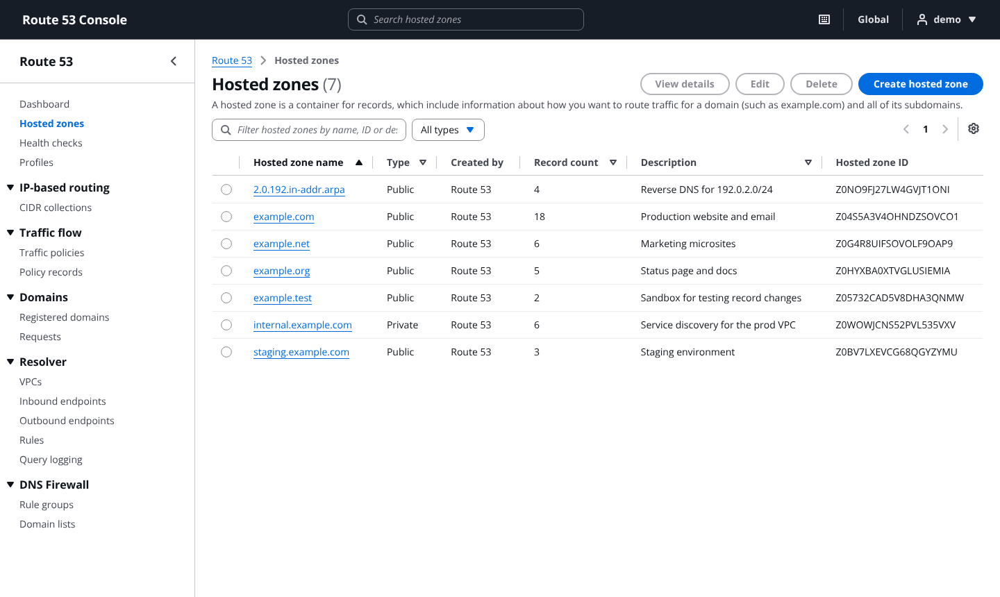
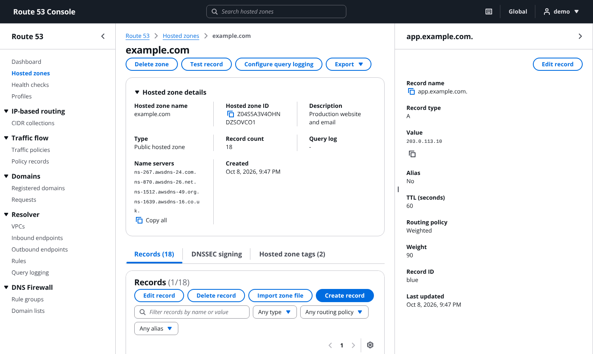
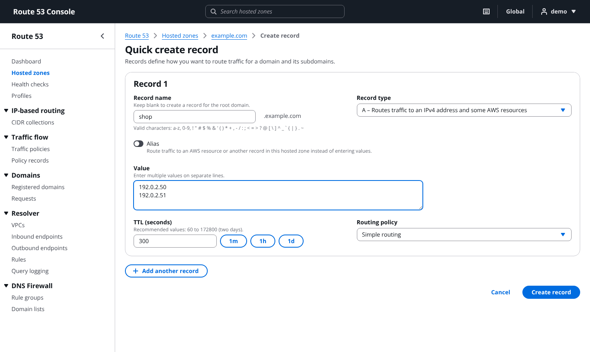
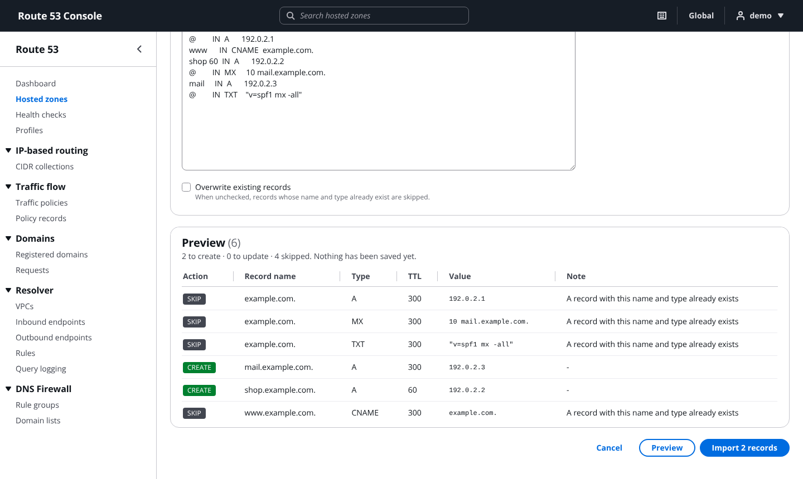
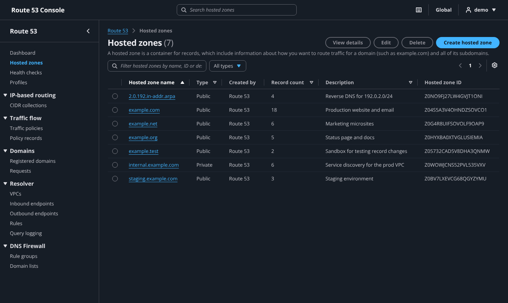
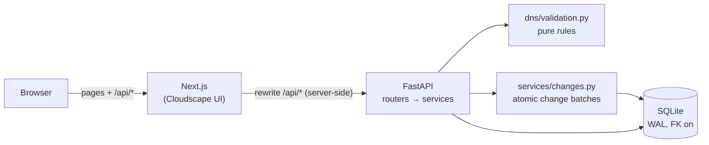
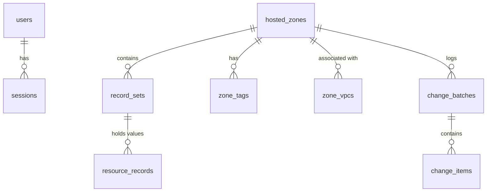

# Route 53 Console Clone

A working clone of the AWS Route 53 console for managing hosted zones and DNS records. It uses Next.js (TypeScript) for the UI, FastAPI for the API and SQLite for storage.

**Live demo:** `<your-vercel-url>` · sign in with `demo` / `route53-demo` (pre-filled)



I focused on two things:

1. **Look and feel.** The UI is built with [Cloudscape](https://cloudscape.design), the open-source design system that the AWS console itself uses. Tables, split panels, flash notifications and forms therefore behave the way they do in Route 53.
2. **Route 53 behaviour, not just CRUD.** The backend enforces the rules the real service enforces. Examples: new zones get NS/SOA records automatically, a zone that still has records can't be deleted, a CNAME can't coexist with other records, and record writes go through atomic change batches.

---

## Contents

- [Features](#features)
- [Running locally](#running-locally)
- [Architecture](#architecture)
- [Database schema](#database-schema)
- [API overview](#api-overview)
- [Route 53 rules implemented](#route-53-rules-implemented)
- [Testing](#testing)
- [Deployment](#deployment)
- [Design decisions](#design-decisions)
- [Limitations and next steps](#limitations-and-next-steps)

---

## Features

| Area | What works |
|---|---|
| **Auth (mocked)** | Login, logout, and a session that survives a refresh. Sessions live server-side (SQLite) behind an HttpOnly cookie. Middleware redirects to `/login` when there's no session. |
| **Hosted zones** | List, search (name / ID / description), filter by type, sort, paginate, create (public or private with a VPC, plus tags), edit (description and tags; the name can't change), and delete (blocked while the zone still has records). |
| **Records** | A, AAAA, CNAME, TXT, MX, NS, PTR, SRV and CAA, plus editing the zone's SOA/NS. List, search by name **or value**, filter by type / routing policy / alias, sort and paginate. Create several records at once ("Add another record"), edit, and delete one or many. |
| **Routing** | Simple and Weighted (weight + record ID), plus Alias records. |
| **Console UX** | Route 53 navigation and breadcrumbs, record details split panel, Flashbar notifications showing the change ID, confirmation modals (type `delete`), column and page-size preferences, empty states. |
| **Placeholders** | Dashboard (shows zone count), Health checks, Traffic policies, Resolver, Profiles, Domains and DNS Firewall, all as "Coming soon" pages. |
| **Bonus** | BIND zone-file import with a server-side **preview**; export as BIND or Route 53 JSON; dark mode; keyboard shortcuts; bulk delete. |

<details>
<summary>More screenshots</summary>

| | |
|---|---|
|  |  |
|  |  |

</details>

**Keyboard shortcuts:** `/` search · `c` create · `g h` hosted zones · `g d` dashboard · `t` dark mode · `?` help

---

## Running locally

Requirements: Python 3.11+ and Node 18.18+ (Node 20 recommended).

```bash
# 1. Backend  (http://localhost:8000, API docs at /docs)
cd backend
python -m venv .venv && source .venv/bin/activate     # Windows: .venv\Scripts\activate
pip install -r requirements-dev.txt
uvicorn app.main:app --reload --port 8000

# 2. Frontend (http://localhost:3000), in a second terminal
cd frontend
npm install
npm run dev
```

On first start the backend creates `backend/data/route53.db` and seeds a demo account with 7 zones. To start fresh, delete that file, or use **Reset demo data** in the user menu.

**With Docker:** `docker compose up --build` starts both services on ports 3000 and 8000.

Configuration is through environment variables. See `backend/.env.example` and `frontend/.env.example`.

---

## Architecture



**Request flow (create a record):**
1. The Quick-create form sends `POST /api/hosted-zones/{id}/changes` with a list of `CREATE` actions.
2. Next.js rewrites the request to FastAPI. The browser only ever talks to one origin, so the session cookie is first-party and there's no CORS.
3. A `current_user` dependency resolves the session cookie to a user. The zone is looked up **scoped to that user's account**.
4. `apply_changes` normalises and validates every record, then opens `BEGIN IMMEDIATE` and applies the changes one by one. Each change is checked against the database state *including the earlier changes in the batch*.
5. On any error it rolls back and returns `InvalidChangeBatch` with every message. On success it commits and returns a `ChangeInfo` (`C…` id, `INSYNC`).
6. TanStack Query invalidates the records, zone and zone-list caches, and the table refetches.

```
backend/app/
  main.py            app setup, CORS, error handlers, startup (schema + seed)
  config.py          env-based settings
  db.py              connection per request, PRAGMAs, transaction() helper
  schema.sql         tables, constraints, indexes
  schemas.py         Pydantic request/response models (the API contract)
  deps.py            current_user dependency
  errors.py          AWS-style {code, message} errors
  dns/validation.py  name + value normalisation per record type (no I/O)
  dns/zonefile.py    BIND parse (dnspython) and BIND/JSON export
  services/          zones, records (read), changes (write engine), importer, auth
  routers/           HTTP endpoints only
  seed.py            demo data
frontend/src/
  app/               Next.js App Router pages (URL paths mirror the console: /route53/v2/hostedzones/...)
  components/        shell, navigation, modals, record form, notifications, theme, shortcuts
  lib/               typed API client, types, DNS helpers
  middleware.ts      redirect to /login when there's no session cookie
```

---

## Database schema



| Table | Key columns | Notes |
|---|---|---|
| `users` | `id`, `username` UNIQUE, `password_hash` (bcrypt), `account_id` | Mocked AWS account (12 digits). |
| `sessions` | `token` PK, `user_id` FK, `expires_at` | 256-bit random token. Deleting the row = logout. |
| `hosted_zones` | `id` (`Z…`), `account_id`, `name` (`example.com.`), `is_private`, `comment`, `caller_reference` | Every query filters by `account_id`. Duplicate public names are allowed, as in Route 53. |
| `zone_vpcs` / `zone_tags` | composite PKs | Child rows, `ON DELETE CASCADE`. |
| `record_sets` | `zone_id`, `name`, `type`, `ttl`, `routing_policy`, `set_identifier`, `weight`, `alias_*` | `UNIQUE(zone_id, name, type, set_identifier)`. `set_identifier` defaults to `''`, not `NULL`, because SQLite treats every NULL as distinct in UNIQUE constraints. |
| `resource_records` | `record_set_id`, `position`, `value` | One row per value, so the API can search by value and keep the order. |
| `change_batches` / `change_items` | `id` (`C…`), action, JSON snapshot | Audit trail for every write, like Route 53's `ChangeInfo`. |

The full DDL is in [`backend/app/schema.sql`](backend/app/schema.sql). Each connection sets `foreign_keys=ON` (SQLite doesn't enforce foreign keys by default), `journal_mode=WAL` and `busy_timeout=5000`.

---

## API overview

Interactive docs: `http://localhost:8000/docs`. Errors are always `{"error": {"code", "message", "details"}}`.

| Method | Path | Purpose |
|---|---|---|
| POST | `/api/auth/login` | Sign in and set the HttpOnly session cookie |
| POST | `/api/auth/logout` | Delete the session |
| GET | `/api/auth/me` | Current user |
| GET | `/api/hosted-zones?q=&type=&page=&page_size=&sort=&order=` | List / search zones |
| POST | `/api/hosted-zones` | Create a zone (adds NS + SOA) |
| GET / PATCH / DELETE | `/api/hosted-zones/{id}` | Get / update description+tags / delete (`HostedZoneNotEmpty`) |
| GET | `/api/hosted-zones/{id}/records?q=&type=&routing_policy=&page=&page_size=&sort=` | List / search records |
| POST | `/api/hosted-zones/{id}/records` | Create one record |
| GET / PUT / DELETE | `/api/hosted-zones/{id}/records/{recordId}` | Get / edit / delete one record |
| POST | `/api/hosted-zones/{id}/records/bulk-delete` | Delete many records in one atomic batch |
| POST | `/api/hosted-zones/{id}/changes` | `ChangeResourceRecordSets`: CREATE / UPSERT / DELETE, all-or-nothing |
| GET | `/api/hosted-zones/{id}/changes` | Change history |
| POST | `/api/hosted-zones/{id}/import` | BIND import (`dry_run: true` = preview, rolled back) |
| GET | `/api/hosted-zones/{id}/export?format=bind\|json` | Download the zone |
| POST | `/api/demo/reset` | Restore demo data for the signed-in account |
| GET | `/api/health` | Health check |

Error codes used: `NotAuthenticated`, `InvalidCredentials`, `NoSuchHostedZone`, `NoSuchRecordSet`, `InvalidDomainName`, `InvalidVPCId`, `ConflictingDomainExists`, `HostedZoneNotEmpty`, `InvalidChangeBatch`, `InvalidZoneFile`, `InvalidInput`.

---

## Route 53 rules implemented

- A new zone gets an apex **NS** record (4 name servers in the `awsdns` pattern: `.com` 0–511, `.net` 512–1023, `.org` 1024–1535, `.co.uk` 1536–2047) and an **SOA** record. These can be edited but not deleted.
- **A zone's name is immutable.** Only the description and tags can change.
- **`HostedZoneNotEmpty`:** a zone can only be deleted when it holds nothing but its NS/SOA.
- **Private zones** need a VPC. Two private zones with the same name can't share a VPC (`ConflictingDomainExists`).
- Record names: relative (`www`), `@` or fully qualified. They're lower-cased and stored with the trailing dot. Wildcards are allowed only as the left-most label. Names must be inside the zone.
- **CNAME:** not allowed at the apex, and can't share a name with any other type (RFC 1034 §3.6.2).
- Values are validated and normalised per type: IPv4/IPv6 via `ipaddress`; MX `priority host`; SRV `priority weight port target`; CAA `flags tag "value"`; TXT quoted strings of at most 255 characters each (longer text is split into several strings); hostnames get a trailing dot.
- **Routing:** one Simple record per name+type, or several Weighted records (each with a record ID and a weight of 0–255), never both.
- **Alias:** no TTL, no values, and a valid target DNS name.
- **Change batches** are atomic, and a `DELETE` must match the current values (protects against deleting something that just changed).

---

## Testing

```bash
cd backend && pytest -q          # 75 tests: validators, API rules, import/export round trip
cd frontend && npm run typecheck && npm run lint && npm run build
```

GitHub Actions (`.github/workflows/ci.yml`) runs both on every push.

What the tests cover:
- every value format, valid and invalid
- auth (cookie flags, logout invalidation)
- zone rules (auto NS/SOA, immutable name, not-empty delete, private VPC conflict)
- record rules (CNAME, duplicates, weighted, alias, outside-zone)
- change-batch atomicity, and a batch that sees its own earlier changes
- search that treats `_` literally
- pagination
- a BIND **import → export → re-import** round trip that compares the record sets

---

## Deployment

See [DEPLOYMENT.md](DEPLOYMENT.md). In short: the **backend runs on Railway** with a persistent volume for the SQLite file, and the **frontend runs on Vercel** with `BACKEND_URL` pointing at the Railway URL.

---

## Design decisions

| Decision | Why | Trade-off |
|---|---|---|
| **Cloudscape** for UI | It's the design system the AWS console is built on, and the brief asks for the same look and feel. My time went into Route 53 flows instead of re-implementing table styling. | A larger JS bundle. Every page is a client component (Cloudscape needs the browser). |
| **Change-batch engine** for all record writes | Mirrors `ChangeResourceRecordSets`. One place enforces the rules, and bulk delete and import come for free. | Single-record endpoints are thin wrappers around a batch of one. |
| **Raw SQL** (`sqlite3`) instead of an ORM | Small schema. Every query is visible and parameterised, and I rely on SQLite features directly (`LIKE ... ESCAPE`, `BEGIN IMMEDIATE`). | No automatic migrations; `schema.sql` uses `CREATE IF NOT EXISTS`. |
| **Server-side sessions** instead of JWT | Logout really ends the session, the HttpOnly cookie can't be read by JS, and there's no token revocation problem. | One DB lookup per request (indexed primary key, negligible here). |
| **Next.js rewrite proxy** for `/api` | Same-origin requests: first-party cookie, no CORS preflight, and the backend URL isn't exposed to the browser. | `BACKEND_URL` is read at build time, so changing it needs a redeploy. |
| **Server-side pagination/search** | Scales past one page of data, and the API does the real work. | Offset pagination. Route 53 uses marker-based pages, which are better for very large or changing lists. |
| **dnspython** for BIND parsing | Zone files have `$ORIGIN`, `$TTL`, `@`, parentheses and escapes. A proven parser beats a hand-written one. | One extra dependency. |
| **Dry-run = real run + rollback** | The import preview can't disagree with the actual import. | The preview briefly holds the write lock. |
| **RFC 2606/5737 demo data** | `example.com` and `192.0.2.0/24` are reserved for documentation, so nothing points at real systems. | — |

---

## Limitations and next steps

- No real DNS resolution. Health checks, traffic policies, DNSSEC and query logging are placeholders. The next feature I'd build is the console's **Test record** tool: a resolver over the stored records with wildcard matching and CNAME chasing.
- Only Simple and Weighted routing. Latency, failover, geolocation and multivalue would extend `routing_policy` plus a few extra columns.
- SQLite allows a single writer, so the backend runs one process. For several instances I'd move to Postgres. The SQL is mostly portable apart from the PRAGMAs and `BEGIN IMMEDIATE`.
- TypeScript types are maintained by hand to match the Pydantic models. Generating them from the OpenAPI schema (`openapi-typescript`) would remove that drift risk.
- No frontend unit tests. A Playwright smoke test (`e2e/smoke_test.py`) drives the main flows end to end against a running stack; it is not wired into CI yet.

---

*Not affiliated with Amazon Web Services. "Route 53" refers to the product this project imitates for an assignment.*
